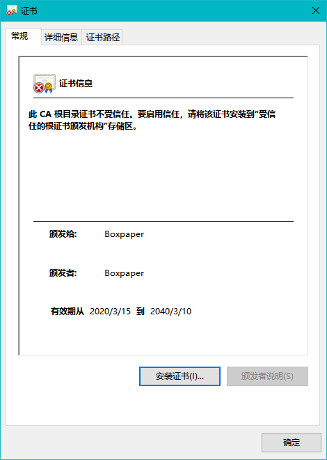
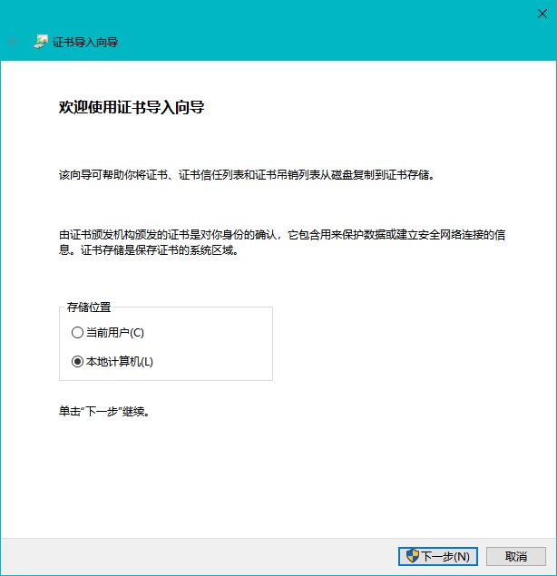
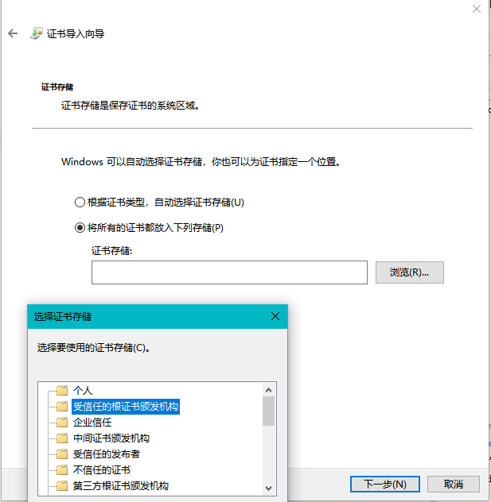
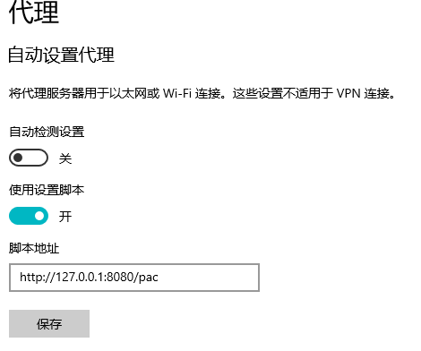

首先需要有Python3，自行百度即可(没有的话下一步也跳过去下载release)

然后需要用到pip，打开cmd，定位到代码目录，执行`pip install -r requirements.txt`，即可安装所有的依赖

完了打开setting.ini，把url这个值设置为自己面板服务器的地址

（以下是win10的证书安装方法因为别的系统没试过）
接下来双击目录下的证书selfsigned.crt，打开如下界面

然后点击安装证书，存储位置选择“本地计算机”

最后选择“将所有的证书都放入下列存储”，点击浏览，弹窗选择“受信任的根证书颁发机构”

证书安装完成了，然后设置系统代理
首先运行Proxy.py，不会运行点run.bat（其他系统的自行换），然后去系统代理设置，找到“使用设置脚本”，打开并填入http://127.0.0.1:8080/pac
（端口自己设置也行），点击保存

大功告成！

